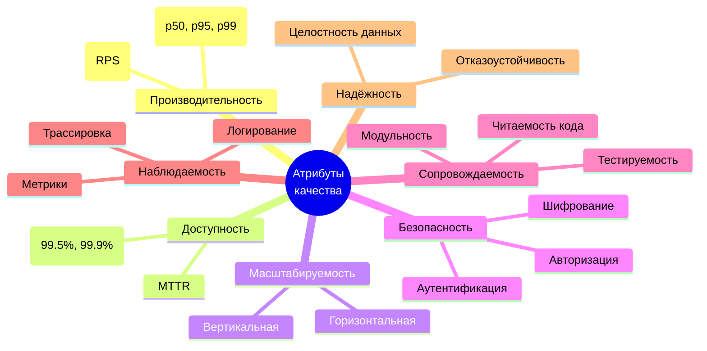
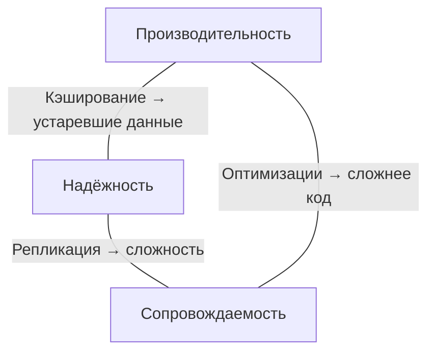
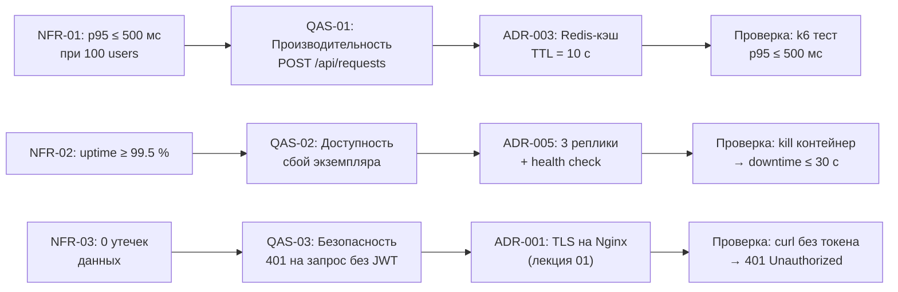

# Лекция 02. Требования к интернет-системам и атрибуты качества. Архитектурные решения (ADR)

> **Дисциплина:** Проектирование интернет-систем (ПИС)  
> **Курс:** 3, Семестр: 6  
> **Лекция:** 2 из 16  
> **Сквозной пример:** ПСО «Юго-Запад»

---

## Зачем эта тема и где она применяется

На прошлой лекции мы развернули минимальную интернет-систему из трёх контейнеров и увидели, **из чего** состоит серверная часть. Но архитектура - это не просто набор контейнеров. Архитектура - это **набор решений**, и каждое решение рождается из конкретной потребности.

Сегодня мы зададим себе вопрос: *«Как понять, что именно система должна делать и насколько хорошо?»* Ответ приведёт нас к трём связанным дисциплинам:

1. **Требования** - что система должна делать (функциональные) и как хорошо (нефункциональные).
2. **Атрибуты качества** - измеримые свойства системы, которые определяют архитектуру.
3. **ADR** - формализованный способ фиксации архитектурных решений, чтобы через полгода не задаваться вопросом «почему мы это сделали?».

В реальных проектах 80 % архитектурных проблем - это не проблемы кода, а проблемы **непроговорённых требований** и **незафиксированных решений**. Архитектор, который не управляет требованиями, - как штурман без карты: маршрут будет, но вряд ли оптимальный.

---

## Результаты обучения

После этой лекции вы будете:

1. ✅ Различать функциональные (FR) и нефункциональные (NFR) требования и понимать, почему NFR формируют архитектуру.
2. ✅ Знать 7 ключевых атрибутов качества интернет-системы и уметь формулировать **сценарии качества**.
3. ✅ Записывать архитектурные решения в формате **ADR** с контекстом, альтернативами, последствиями и проверкой.
4. ✅ Связывать цепочку **NFR → атрибут качества → ADR → проверка** на примере ПСО «Юго-Запад».
5. ✅ Заполнять шаблоны **mini-SRS** и **Quality Attribute Scenarios** для своего проекта.

---

## Пререквизиты

- **Лекция 01**: компоненты серверной части, границы, reverse proxy, Docker Compose, ADR-001, ADR-002.
- **Базовое**: HTTP, REST (GET/POST), JSON. Терминал (PowerShell или bash).

---

## 1. Введение: «картина мира» - от идеи до работающей системы

### Аналогия: проектирование здания

Представьте, что вы проектируете здание для спасательного отряда. Заказчик говорит: «Нужна база для 30 спасателей с гаражом для техники». Это - функциональные требования. Но хороший архитектор задаст ещё десяток вопросов:

- *Какой климат?* (→ теплоизоляция, аналог **производительности**)
- *Сейсмоопасный район?* (→ усиленный каркас, аналог **отказоустойчивости**)
- *Как быстро спасатели должны выезжать?* (→ ширина ворот, прямой выезд - аналог **латентности**)
- *Будет ли расширение на 60 человек?* (→ модульная конструкция - аналог **масштабируемости**)

Без этих вопросов вы построите здание, которое *формально работает*, но рухнет при первом землетрясении. То же самое с программными системами: функциональность - это пол, а качество - потолок.

### Ментальная модель: конвейер от требований к проверке

```text
Бизнес-цели → FR/NFR/Ограничения → Атрибуты качества (приоритеты + метрики)
                                                ↓
                                    Архитектурные решения (ADR)
                                                ↓
                                    Проверка (SLI/SLO, тесты, observability)
```

Это не линейный waterfall - это **итеративный цикл**. Каждое NFR порождает решение, решение влияет на другие характеристики, и мы пересматриваем приоритеты. Но **без явного старта** (зафиксированные требования) цикл не запускается.

> **Принцип из FOSA (Richards, Ford):** *«Если характеристика не измеряется - это не характеристика, а лозунг.»*

---

## 2. Функциональные и нефункциональные требования

### Определения

| Термин | Определение | Пример (ПСО «Юго-Запад») |
| -------- | ---------- | -------------------------- |
| **Функциональное требование (FR)** | Описывает *что* система делает - действие, данные, результат | «Диспетчер создаёт заявку с координатами, типом и приоритетом» |
| **Нефункциональное требование (NFR)** | Описывает *как хорошо* система это делает - свойство качества | «Создание заявки занимает < 500 мс при 100 одновременных запросах» |
| **Ограничение (Constraint)** | Внешнее условие, которое мы не можем изменить | «Использовать PostgreSQL (стандарт организации)» |

### Почему NFR важнее для архитектуры, чем FR

Функциональные требования **одинаково** реализуемы в разных архитектурах: вы можете создать заявку и в монолите, и в микросервисах, и в serverless-функции. Но если вам нужны:

- ≤ 200 мс латентность → нужен кэш или read replica
- 99.9 % availability → нужна репликация и фейловер
- 1000 RPS → нужен горизонтальное масштабирование

…то **именно NFR определяют архитектуру**. Два приложения с одинаковыми FR, но разными NFR, будут иметь разную архитектуру.

### Пример: mini-SRS для ПСО «Юго-Запад»

```markdown
# Mini-SRS: ПСО «Юго-Запад»

## Контекст и цели
- Цель: система управления спасательными операциями
- Основные актёры: диспетчер, координатор, спасатель, администратор
- Scope: приём заявок, назначение групп, мониторинг операций
- Out of scope: финансы, HR, закупки

## Функциональные требования (FR)

### FR-01: Создание заявки
- Описание: Диспетчер создаёт заявку о помощи
- Основной сценарий: POST /api/requests → валидация → сохранение → 201 Created
- Исключения: дублирующие координаты, невалидный тип
- Критерии приёмки: заявка отображается в списке, статус = NEW

### FR-02: Назначение группы на заявку
- Описание: Координатор назначает свободную группу
- Основной сценарий: POST /api/requests/{id}/assign → проверка доступности → назначение
- Исключения: группа уже занята, заявка закрыта
- Критерии приёмки: группа получает уведомление, статус заявки = ASSIGNED

### FR-03: Отслеживание статуса операции
- Описание: Любой актор видит текущий статус в реальном времени
- Основной сценарий: GET /api/operations/{id}/status → текущий статус + координаты группы
- Исключения: операция не существует
- Критерии приёмки: статус обновляется не реже 1 раза в 30 секунд

## Нефункциональные требования (NFR)

### NFR-01: Время отклика
- При нагрузке: 100 одновременных пользователей
- Операция: создание заявки (POST /api/requests)
- Метрика: p95 latency
- Цель: ≤ 500 мс
- Период: при нормальной работе (будни, 08:00–22:00)

### NFR-02: Доступность
- При нагрузке: штатная
- Операция: все критические эндпоинты
- Метрика: uptime
- Цель: ≥ 99.5 % (≈ 1.8 дня простоя в год)
- Период: скользящие 30 дней

### NFR-03: Безопасность
- При нагрузке: любая
- Операция: все API-эндпоинты
- Метрика: все запросы аутентифицированы (JWT)
- Цель: 0 неаутентифицированных доступов к защищённым ресурсам
- Период: постоянно
```

**Обратите внимание:** каждое NFR содержит **метрику** и **условие нагрузки**. «Система должна быть быстрой» - это не NFR, а лозунг. «p95 ≤ 500 мс при 100 concurrent users» - это NFR.

---

## 3. Атрибуты качества интернет-системы

### Основные определения

- **Атрибут качества (Quality Attribute)** - измеримое свойство системы, важное для стейкхолдеров. Синонимы в литературе: «архитектурная характеристика» (FOSA), «нефункциональное свойство», «cross-cutting concern».
- **Компромисс (Trade-off)** - улучшение одного атрибута часто ухудшает другой. Архитектура - это искусство **осознанных компромиссов**.

### Семь ключевых атрибутов для интернет-систем



Рассмотрим каждый на примере ПСО «Юго-Запад».

#### 3.1. Производительность (Performance)

**Что измеряем:** латентность (время ответа) и пропускная способность (количество запросов в секунду).

**Почему важно для ПСО:** задержка в создании заявки = задержка в спасательной операции. Когда человек в опасности, каждая секунда имеет значение.

**Типичные метрики:**

| Метрика | Описание | Цель для ПСО |
| --------- | ---------- | -------------- |
| p50 latency | Медиана - 50 % запросов быстрее | ≤ 200 мс |
| p95 latency | 95-й перцентиль - только 5 % медленнее | ≤ 500 мс |
| p99 latency | 99-й перцентиль - «хвост» распределения | ≤ 1000 мс |
| RPS | Запросов в секунду | ≥ 100 |

**Ход мысли:** почему не просто среднее? Потому что среднее скрывает «хвосты». Если средний запрос - 100 мс, а каждый 100-й - 10 секунд, среднее покажет «всё нормально», но каждый 100-й пользователь ждёт 10 секунд. Перцентили честнее.

#### 3.2. Доступность (Availability)

**Что измеряем:** процент времени, когда система отвечает корректно.

**Формула:**

$$
\text{Availability} = \frac{\text{Uptime}}{\text{Uptime} + \text{Downtime}} \times 100\%
$$

**Бюджет простоя (таблица «девяток»):**

| Уровень | Простой в год | Простой в месяц |
| --------- | -------------- | ----------------- |
| 99 % | 3.65 дня | 7.3 часа |
| 99.5 % | 1.83 дня | 3.65 часа |
| 99.9 % | 8.76 часа | 43.8 мин |
| 99.99 % | 52.6 мин | 4.38 мин |

**Для ПСО:** 99.5 % - это ≈ 3.65 часа простоя в месяц. Для некритичного веб-приложения - допустимо. Для системы, от которой зависят жизни людей, стоит стремиться к 99.9 %, но каждая «девятка» - это экспоненциально растущие затраты.

**Ключевые термины:**

- **MTBF** (Mean Time Between Failures) - средняя наработка на отказ
- **MTTR** (Mean Time To Recovery) - среднее время восстановления

$$
\text{Availability} = \frac{\text{MTBF}}{\text{MTBF} + \text{MTTR}}
$$

> **Мысль:** часто дешевле уменьшить MTTR (быстрее восстанавливаться), чем увеличить MTBF (реже ломаться). Автоматический restart контейнера - это про MTTR.

#### 3.3. Масштабируемость (Scalability)

**Что измеряем:** как система справляется с ростом нагрузки.

| Тип | Как | Пример для ПСО |
| ----- | ----- | ----------------- |
| **Вертикальная** | Добавить ресурсов одному серверу (CPU, RAM) | Увеличить RAM PostgreSQL с 2 до 8 ГБ |
| **Горизонтальная** | Добавить экземпляры (replicas) | Запустить 3 экземпляра FastAPI за Nginx |

**Горизонтальная масштабируемость** - предпочтительна для интернет-систем: дешевле, отказоустойчивее (если один экземпляр упал - остальные работают), бесконечно расширяема (теоретически).

**Но есть требование:** приложение должно быть **stateless** (без состояния в памяти). Если сессия хранится в RAM одного экземпляра - горизонтальное масштабирование невозможно без sticky sessions или внешнего хранилища сессий (Redis).

#### 3.4. Безопасность (Security)

**Что измеряем:** защищённость системы от несанкционированного доступа, утечек данных, атак.

**Для ПСО:** координаты жертв и спасательных групп - чувствительные данные. Утечка → риск для людей.

**Минимальные требования:**

- **Аутентификация**: кто ты? (JWT-токен)
- **Авторизация**: что тебе можно? (RBAC: диспетчер ≠ спасатель)
- **Шифрование**: TLS на всех внешних границах (уже решили в ADR-001, лекция 01)
- **Аудит**: кто, когда, что сделал (audit log)

#### 3.5. Сопровождаемость (Maintainability)

**Что измеряем:** насколько легко изменять, расширять, исправлять систему.

**Почему это атрибут качества:** команды меняются, требования эволюционируют. Система, которую нельзя изменить без страха всё сломать, - это технический долг, который растёт экспоненциально.

**Как измерить:**

- **Цикломатическая сложность** - чем выше, тем сложнее тестировать
- **Время на внедрение нового use case** - фактический показатель
- **Покрытие тестами** - индикатор уверенности при изменениях

**Связь с Clean Architecture [О2]:** правило зависимости (зависимости внутрь) - это **инструмент сопровождаемости**. Когда бизнес-логика не зависит от фреймворка - замена фреймворка не затрагивает ядро.

#### 3.6. Наблюдаемость (Observability)

**Что измеряем:** можем ли мы понять, что происходит в системе прямо сейчас и почему.

**Три столпа наблюдаемости:**

| Столп | Что даёт | Инструмент (пример) |
| ------- | ---------- | --------------------- |
| **Логи** | Конкретные события («заявка #42 создана») | ELK stack, Loki |
| **Метрики** | Агрегированные числа (p95 = 320 мс) | Prometheus + Grafana |
| **Трассировка** | Путь запроса через сервисы | Jaeger, Zipkin |

**Для ПСО:** если время создания заявки внезапно вырастет до 5 секунд - мы должны **увидеть это** (метрики + алерт), **понять причину** (трассировка: где задержка?) и **найти детали** (лог: какой запрос к БД тормозит?).

#### 3.7. Надёжность (Reliability)

**Что измеряем:** способность системы выполнять функции корректно, даже при частичных сбоях.

**Разница с доступностью:** доступность - «система отвечает», надёжность - «система отвечает **правильно**». Система может быть доступна, но возвращать устаревшие данные из кэша - она доступна, но ненадёжна.

**Инструменты надёжности:**

- Идемпотентность операций (повторный запрос не создаёт дубль)
- Транзакции (ACID гарантии в БД)
- Circuit breaker (отключение нестабильного внешнего сервиса)
- Retry с backoff (повторные попытки с паузами)

### Компромиссы: «треугольник невозможности»

Нельзя оптимизировать всё одновременно. Классические компромиссы:



**Пример для ПСО:** мы хотим отдавать статус операции за 50 мс. Кэшируем в Redis - получаем скорость, но рискуем показать устаревший статус (группа уже прибыла, а кэш ещё не обновился). Компромисс: TTL кэша = 10 секунд. Это ADR.

---

## 4. Сценарии качества (Quality Attribute Scenarios)

### Определение

**Сценарий качества** - конкретное описание события и ожидаемой реакции системы, привязанное к атрибуту качества. Это **мост** между абстрактным NFR и проверяемым поведением.

### Структура сценария (по SEI/FOSA)

```text
Источник стимула → Стимул → Среда → Артефакт → Отклик → Метрика
```

### Пример: сценарий производительности для ПСО

| Элемент | Значение |
| --------- | ---------- |
| **Атрибут** | Производительность |
| **Источник стимула** | 100 одновременных диспетчеров |
| **Стимул** | Создают заявки (POST /api/requests) |
| **Среда** | Штатная работа, будни, 08:00–22:00 |
| **Артефакт** | API-сервер (FastAPI) |
| **Отклик** | Заявка создана, 201 Created |
| **Метрика** | p95 latency ≤ 500 мс, error rate < 0.1 % |

### Пример: сценарий доступности для ПСО

| Элемент | Значение |
| --------- | ---------- |
| **Атрибут** | Доступность |
| **Источник стимула** | Сбой одного из экземпляров API-сервера |
| **Стимул** | Контейнер завершается с exit code 1 |
| **Среда** | Штатная работа, 3 экземпляра за балансировщиком |
| **Артефакт** | Кластер API-серверов |
| **Отклик** | Оставшиеся 2 экземпляра принимают нагрузку; Docker restart policy перезапускает упавший |
| **Метрика** | Downtime ≤ 30 секунд, потеря запросов = 0 (retry на клиенте) |

### Пример: сценарий безопасности для ПСО

| Элемент | Значение |
| --------- | ---------- |
| **Атрибут** | Безопасность |
| **Источник стимула** | Неаутентифицированный пользователь |
| **Стимул** | GET /api/requests (без JWT-токена) |
| **Среда** | Любая |
| **Артефакт** | API Gateway / middleware аутентификации |
| **Отклик** | 401 Unauthorized, тело запроса не обрабатывается |
| **Метрика** | 0 утечек данных через незащищённые эндпоинты |

> **Зачем так формально?** Потому что абстрактное «система должна быть безопасной» невозможно проверить. А «неаутентифицированный запрос к /api/requests возвращает 401» - можно проверить за 5 секунд с помощью `curl`.

---

## 5. Architecture Decision Records (ADR)

### Зачем записывать решения?

Каждый день команда принимает десятки решений: какую СУБД использовать, как обрабатывать ошибки, куда класть кэш. Через 3 месяца никто не помнит *почему*. ADR фиксирует **контекст** решения - не только *что*, но и *зачем* и *какие альтернативы отвергли*.

> **Аналогия:** ADR - это бортовой журнал штурмана. Он не пишет «мы повернули направо». Он пишет «мы повернули направо, потому что слева - обрыв, а прямо - затор, и мы приняли риск увеличения маршрута на 10 минут».

### Формат ADR (рекомендуемый)

Мы используем расширенный формат Michael Nygard, дополненный проверкой:

```markdown
# ADR-XXXX: <краткое название решения>

## Контекст
Почему решение нужно: проблема, ограничения, цели качества.

## Затрагиваемые архитектурные характеристики
- Характеристика: ↑/↓/неизвестно (почему)

## Решение
Что выбрали (конкретно, без воды).

## Альтернативы
- Вариант 1: плюсы/минусы
- Вариант 2: плюсы/минусы

## Последствия
- Плюсы:
- Минусы:
- Риски:

## Проверка
- Метрики (SLI/SLO):
- Тесты:
- Эксплуатационные проверки:
```

### Ключевое отличие от лекции 01

В лекции 01 мы написали ADR-001 (TLS termination) и ADR-002 (PostgreSQL) в упрощённом виде. Теперь мы понимаем, что в ADR **должны быть**:

1. **Затрагиваемые характеристики** - решение всегда влияет на несколько атрибутов качества
2. **Альтернативы** - без них непонятно, почему выбрали именно это
3. **Проверка** - как убедиться, что решение работает

### Пример: ADR-003 для ПСО «Юго-Запад»

```markdown
# ADR-003: Кэширование статуса операции в Redis

## Контекст
Эндпоинт GET /api/operations/{id}/status вызывается каждые 10 с из UI
каждого активного пользователя. При 50 активных операциях и 10
пользователях на каждую - это 50 × 10 / 10 = 50 RPS к БД только для
чтения статусов. PostgreSQL справится, но мы хотим запас для роста и
снижения нагрузки на БД.

## Затрагиваемые архитектурные характеристики
- Производительность: ↑ (чтение из Redis ≈ 1 мс vs PostgreSQL ≈ 5–10 мс)
- Надёжность: ↓ (риск устаревших данных в кэше)
- Сопровождаемость: ↓ (дополнительный компонент + логика инвалидации)

## Решение
- Кэшируем статус операции в Redis с TTL = 10 секунд.
- При обновлении статуса - инвалидируем кэш (write-through).
- Fallback: при недоступности Redis - чтение напрямую из PostgreSQL.

## Альтернативы
- **Не кэшировать**: проще, но при росте нагрузки БД станет узким местом.
- **CDN-кэш на уровне Nginx**: не подходит - данные персонализированы.
- **Materialized view в PostgreSQL**: сложнее в обновлении,
  нет выигрыша по latency.

## Последствия
- Плюсы: снижение нагрузки на PostgreSQL в ~10×, латентность чтения < 5 мс.
- Минусы: добавляем зависимость от Redis, нужна стратегия инвалидации.
- Риски: при сбое инвалидации - пользователь видит устаревший статус.

## Проверка
- SLI: p95 latency GET /api/operations/{id}/status
- SLO: p95 ≤ 50 мс при 200 RPS
- Тест: нагрузочный тест (Locust/k6), проверка cache invalidation
- Эксплуатация: дашборд Grafana с cache hit rate (>90 %)
```

### Пример: ADR-004 для ПСО «Юго-Запад»

```markdown
# ADR-004: Таймауты и ретраи для внешних API (геолокация)

## Контекст
Сервис ПСО обращается к внешнему API геолокации для обратного
геокодирования координат заявки (координаты → адрес). API нестабилен:
наблюдаются кратковременные 5xx и всплески задержек до 3 секунд.

## Затрагиваемые архитектурные характеристики
- Надёжность: ↑ (повторные попытки скрывают кратковременные сбои)
- Производительность: ↓ (при ретрае - удвоение времени)
- Безопасность: ~ (без изменений)

## Решение
- Таймаут на внешний вызов: 2 секунды.
- Ретраи: максимум 2 попытки на идемпотентные GET-запросы.
- Backoff: 200 мс → 400 мс + джиттер (случайность ±50 мс).
- На неидемпотентные POST - ретраи не применяем.
- При полном отказе - возвращаем координаты без адреса (graceful degradation).

## Альтернативы
- Без ретраев: проще, но больше отказов видит пользователь.
- Длинные таймауты (10 с): меньше ложных отказов, но p95/p99 деградирует.
- Локальная база геокодирования: надёжно, но затратно и устаревает.

## Последствия
- Плюсы: 90 % кратковременных сбоев скрыты от пользователя.
- Минусы: нужна идемпотентность и дедупликация.
- Риски: thundering herd при массовых ретраях.

## Проверка
- SLI: error rate внешнего вызова (после ретраев)
- SLO: error rate < 1 % при 100 RPS
- Тест: mock внешнего API с 50 % 5xx → проверить, что p95 ≤ 3 с
```

---

## 6. Связка «NFR → атрибут → ADR → проверка»

Это центральная идея лекции. Каждый элемент архитектуры должен иметь **трассируемость** до требования:



**Зачем это нужно?**

- **Для архитектора:** каждое решение мотивировано. Нет «решений ради решений».
- **Для команды:** новый участник понимает, почему Redis, а не Memcached.
- **Для ревью:** при изменении требований можно пересмотреть связанные ADR.
- **Для аудита:** заказчик видит, как требования превратились в конкретные решения.

---

## 7. Практический блок: формулируем требования и пишем ADR

### Шаг 1. Выявление FR из пользовательских историй

Для ПСО «Юго-Запад» возьмём один бизнес-сценарий и разложим его:

**Сценарий:** «Срочная заявка - вызов группы»

1. Диспетчер создаёт заявку с приоритетом `URGENT` → **FR-01**
2. Система автоматически находит ближайшую свободную группу → **FR-04** (новое)
3. Группа получает push-уведомление → **FR-05** (новое)
4. Координатор видит статус «группа выехала» → **FR-03**

**Обратите внимание:** из одного бизнес-сценария рождается 3–4 FR. А из каждого FR - десяток деталей: что если нет свободных групп? Что если push не доставлен? Каждый «что если» - потенциальное NFR или ограничение.

### Шаг 2. Превращение «хотелок» в измеримые NFR

| «Хотелка» заказчика | Плохой NFR (лозунг) | Хороший NFR (измеримый) |
| --------------------- | --------------------- | ------------------------ |
| «Система должна быть быстрой» | «Высокая производительность» | «p95 ≤ 500 мс при 100 concurrent users для POST /api/requests» |
| «Система не должна падать» | «Высокая доступность» | «Uptime ≥ 99.5 % за скользящие 30 дней» |
| «Данные должны быть защищены» | «Безопасность» | «0 неаутентифицированных доступов; TLS для всех внешних соединений» |
| «Должно работать на телефоне» | «Кроссплатформенность» | «API отвечает JSON; UI - responsive (min 375 px)» |

### Шаг 3. Быстрая проверка: curl без токена

Давайте проверим один из сценариев качества прямо сейчас. Если у вас запущен docker-compose из лекции 01:

```powershell
# Запрос без аутентификации к защищённому эндпоинту
curl -s -o /dev/null -w "%{http_code}" http://localhost:8080/api/requests
```

**Ожидаемый результат:**

- Если аутентификация настроена: `401`
- Если ещё нет: `200` - и это **баг**, сценарий QAS-03 не проходит

Этот пример показывает: сценарий качества - не бумажка, а **реальный тест**.

---

## 8. Ошибки и антипаттерны при работе с требованиями

### ❌ Антипаттерн 1: «Решение вместо требования»

**Плохо:** «Нужен Redis для кэширования» - это решение, а не требование.  
**Хорошо:** «p95 ≤ 50 мс при 200 RPS для GET /api/operations/{id}/status» - а Redis (или другой кэш) - уже следствие.

**Как заметить:** если в формулировке требования есть название технологии - скорее всего, это решение.

### ❌ Антипаттерн 2: «NFR без метрик»

**Плохо:** «Система должна быть масштабируемой».  
**Хорошо:** «При росте нагрузки с 100 до 500 RPS - добавление 2 экземпляров должно вернуть p95 ≤ 500 мс».

**Правило:** если в NFR нет числа - это не NFR.

### ❌ Антипаттерн 3: «ADR без альтернатив»

**Плохо:**

```text
Решение: Используем PostgreSQL.
Конец.
```

**Хорошо:** Контекст → 3 альтернативы → обоснование выбора → последствия → проверка.

**Почему страшно без альтернатив:** через год новый участник спрашивает: «Почему не MongoDB?» Без ADR - тратим часы на повторное обсуждение. С ADR - читаем 2 минуты и понимаем.

### ❌ Антипаттерн 4: «Золотое покрытие» (gold plating)

**Суть:** добавление требований, которые никто не просил. «Давайте сделаем 99.999 % availability!» - звучит круто, но стоит в 100× дороже, чем 99.9 %.

**Ход мысли:** каждый атрибут качества имеет **стоимость**. Задача архитектора - найти точку, где стоимость улучшения превышает выгоду. Для ПСО 99.5 % (≈ 3.65 ч простоя/мес) может быть оптимумом - при наличии ручного fallback (телефонный вызов).

### ❌ Антипаттерн 5: «ADR как ритуал»

**Суть:** команда пишет ADR для галочки, но не обновляет, не читает, не пересматривает.

**Как бороться:**

- ADR хранятся **в репозитории рядом с кодом** (не в Confluence)
- Каждый ADR ревьюится в PR (pull request)
- Пересмотр ADR при изменении контекста (статус: superseded/deprecated)

---

## 9. Приоритизация атрибутов качества

Невозможно оптимизировать всё. Нужен осознанный выбор.

### Метод: матрица приоритетов

Для ПСО «Юго-Запад» расставим приоритеты:

| Атрибут | Приоритет | Обоснование |
| --------- | ----------- | ------------- |
| **Надёжность** | 🔴 Критический | Потеря данных о заявке - угроза жизни |
| **Доступность** | 🔴 Критический | Система недоступна = спасатели не получают заявки |
| **Безопасность** | 🟡 Высокий | Координаты жертв - чувствительные данные |
| **Производительность** | 🟡 Высокий | Задержки критичны, но не смертельны (есть рация) |
| **Наблюдаемость** | 🟢 Средний | Важна для диагностики, но не для пользователей |
| **Масштабируемость** | 🟢 Средний | Пока 1 отряд, рост - на следующий год |
| **Сопровождаемость** | 🟢 Средний | Маленькая команда, но код должен быть понятным |

**Вывод:** надёжность и доступность - «must have», масштабируемость - «nice to have» на текущем этапе. Это влияет на порядок ADR: сначала решения про отказоустойчивость, потом - про горизонтальное масштабирование.

---

## 10. SLI, SLO, SLA: измеряем то, что обещали

### Определения SLI/SLO/SLA

| Термин | Что это | Пример для ПСО |
| -------- | --------- | ---------------- |
| **SLI** (Service Level Indicator) | Метрика, которую мы **измеряем** | p95 latency POST /api/requests |
| **SLO** (Service Level Objective) | Цель, которую мы **ставим** для SLI | p95 ≤ 500 мс за 30 дней |
| **SLA** (Service Level Agreement) | Контракт с **последствиями** при нарушении | «При SLO violation > 2 раз/квартал - компенсация 10 %» |

### Как SLI/SLO связаны с NFR и ADR

```text
NFR-01 (p95 ≤ 500 мс) → SLI: p95 latency → SLO: p95 ≤ 500 мс (30 дней)
                                ↓
                          ADR-003 (Redis-кэш)
                                ↓
                          Мониторинг (Prometheus + Grafana dashboard)
                                ↓
                          Алерт при SLO violation
```

**Важная мысль:** SLO - это **не 100 %**. Если ваш SLO = «p95 ≤ 500 мс 100 % времени», то первый же всплеск нагрузки или деплой нарушит его. Реалистичный SLO: «p95 ≤ 500 мс в 99.5 % измерений за 30 дней» - это даёт **error budget** (бюджет ошибок): 0.5 % времени система может «не соответствовать» SLO, и это нормально.

### Error Budget: когда можно нарушать

$$
\text{Error Budget} = 1 - \text{SLO Target}
$$

При SLO = 99.5 %:

$$
\text{Error Budget} = 1 - 0.995 = 0.005 = 0.5\%
$$

За 30 дней (43200 минут):

$$
\text{Допустимый простой} = 43200 \times 0.005 = 216 \text{ минут} ≈ 3.6 \text{ часов}
$$

Если за месяц система «не соответствовала» SLO менее 3.6 часов - **можно деплоить** (запас есть). Если больше - **замораживаем релизы** и чиним надёжность.

> **Из практики Google SRE [Д6]:** error budget - это механизм баланса между скоростью выпуска фич и надёжностью. Разработчики хотят быстрее деплоить, SRE хотят стабильности. Error budget даёт объективный критерий.

---

## Вопросы для самопроверки

1. **Понятия:** В чём разница между функциональным и нефункциональным требованием? Приведите по одному примеру для ПСО «Юго-Запад».

2. **Почему:** Почему NFR определяют архитектуру в большей степени, чем FR? Приведите пример двух систем с одинаковыми FR, но разными NFR.

3. **Как применить:** Сформулируйте NFR для ПСО: «заявка с приоритетом URGENT должна быть доставлена ближайшей группе не позднее чем через ___». Укажите метрику, условие нагрузки и период.

4. **Понятия:** Назовите 7 ключевых атрибутов качества и объясните, чем «надёжность» отличается от «доступности».

5. **Компромиссы:** Приведите пример компромисса между производительностью и надёжностью при кэшировании. Как TTL кэша влияет на оба атрибута?

6. **Сценарии:** Заполните сценарий качества (все 6 полей) для атрибута «масштабируемость» в ПСО «Юго-Запад».

7. **ADR:** Какие 5 обязательных разделов должны быть в ADR? Почему раздел «Альтернативы» критически важен?

8. **Как применить:** Напишите ADR-005 для решения «хранение JWT-секрета в переменной окружения, а не в коде». Укажите контекст, альтернативы, последствия и проверку.

9. **SLI/SLO:** Чем SLI отличается от SLO? Что такое error budget и зачем он нужен?

10. **Антипаттерны:** Что не так с NFR «система должна быть масштабируемой»? Перепишите его в измеримую форму.

11. **Связка:** Постройте цепочку NFR → QAS → ADR → Проверка для атрибута «наблюдаемость» в ПСО.

12. **Приоритеты:** Почему для ПСО надёжность важнее масштабируемости? В какой ситуации приоритеты поменяются?

13. **Как применить:** У вас есть error budget 0.5 % в месяц. За первую неделю система нарушала SLO 2 часа. Стоит ли деплоить новую фичу? Обоснуйте.

14. **Gold plating:** Заказчик просит 99.99 % availability (≈ 4.38 мин простоя/мес). Какие архитектурные решения потребуются и во сколько раз вырастет стоимость по сравнению с 99.5 %?

15. **Рефлексия:** Вернитесь к ADR-001 и ADR-002 из лекции 01. Какие разделы в них отсутствуют по сравнению с шаблоном из сегодняшней лекции? Дополните один из них.

---

## Глоссарий

| Термин | Определение |
| -------- | ------------ |
| **FR** | Functional Requirement - что система делает |
| **NFR** | Non-Functional Requirement - как хорошо система это делает |
| **Constraint** | Ограничение - внешнее условие, неизменяемое командой |
| **Quality Attribute** | Измеримое свойство системы (производительность, доступность, …) |
| **QAS** | Quality Attribute Scenario - формализованный сценарий качества |
| **ADR** | Architecture Decision Record - запись архитектурного решения |
| **SLI** | Service Level Indicator - измеряемая метрика |
| **SLO** | Service Level Objective - целевое значение SLI |
| **SLA** | Service Level Agreement - контракт с последствиями |
| **Error Budget** | Допустимый «запас» нарушений SLO за период |
| **Trade-off** | Компромисс - улучшение одного свойства за счёт другого |
| **MTBF** | Mean Time Between Failures - средняя наработка на отказ |
| **MTTR** | Mean Time To Recovery - среднее время восстановления |
| **Fitness Function** | Автоматизированная проверка архитектурного свойства |

---

## Список литературы

### Основная (использована в лекции)

1. **[О2]** Мартин, Р. Чистая архитектура. Искусство разработки программного обеспечения. - СПб.: Питер, 2018. - 352 с. - *Требования вокруг use cases; NFR влияют на границы и зависимости.*
2. **FOSA** - Richards, M., Ford, N. Fundamentals of Software Architecture. - O'Reilly, 2020. - *Архитектурные характеристики, компромиссы, сценарии качества, ADR.*
3. **[О6]** Куликов, С. С. Тестирование веб-ориентированных приложений. - Минск: БГУИР, 2017. - 100 с. - *Тестируемость как требование; связь NFR → тесты.*

### Дополнительная

1. **[Д1]** Бейер, Б. и др. Site Reliability Engineering. - СПб.: Питер, 2019. - 592 с. - *SLI/SLO/SLA, error budgets.*
2. Nygard, M. Documenting Architecture Decisions. - 2011. - *Оригинальный формат ADR.*
3. Bass, L. et al. Software Architecture in Practice, 4th ed. - Addison-Wesley, 2022. - *Quality Attribute Scenarios (QAS).*

---

## Связь с литературной основой курса

- **Характеристики:** производительность, доступность, надёжность, безопасность, сопровождаемость, наблюдаемость, масштабируемость.
- **Артефакт:** mini-SRS (FR/NFR), сценарии качества (QAS), ADR (≥ 2 новых).
- **Проверка:** каждый NFR имеет метрику → SLI/SLO → тест или мониторинг-дашборд.

---

## Что дальше

В **лекции 03** мы перейдём к **принципам дизайна** (SOLID, инверсия зависимостей) - инструментам, которые **реализуют** принятые сегодня решения в коде. Если ADR-003 говорит «кэшируем в Redis», то принцип инверсии зависимостей покажет, как сделать так, чтобы use case не знал о Redis напрямую.

---

**Дата создания:** 2026-02-27  
**Лекция:** 02 из 16
