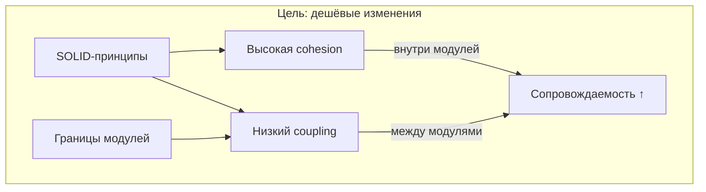
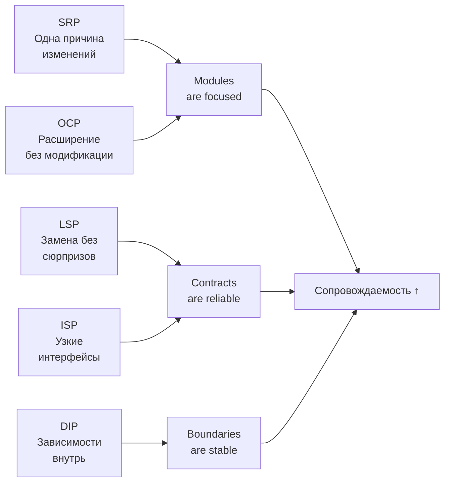
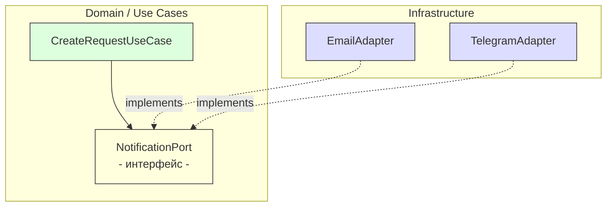

# Лекция 03. Принципы дизайна: SOLID, cohesion/coupling, границы модулей

> **Дисциплина:** Проектирование интернет-систем (ПИС)
> **Курс:** 3, Семестр: 6
> **Тема по учебной программе:** Тема 3 - Принципы дизайна
> **ADR-диапазон:** ADR-005 - ADR-006

---

## Результаты обучения

После лекции студент сможет:

1. Объяснить разницу между **связностью (cohesion)** и **сочетаемостью (coupling)** и распознать симптомы плохого дизайна в реальном коде.
2. Применить каждый из пяти принципов SOLID на уровне модулей и зависимостей интернет-системы, а не как набор «слоганов».
3. Выделять **границы модулей** и проектировать их **публичные контракты**.
4. Использовать принцип инверсии зависимостей (DIP) для отделения бизнес-логики от инфраструктуры.
5. Сформулировать архитектурные проверки (fitness-функции), которые защищают границы от деградации.

---

## Пререквизиты

- ООП на базовом уровне (классы, объекты, интерфейсы).
- Понятие границ и компонентов из **лекции 01**.
- Атрибуты качества и ADR из **лекции 02** (особенно «сопровождаемость»).
- Базовые навыки чтения кода на Java/Python или любом ООП-языке.

Для практики (опционально):

- Windows 10/11, PowerShell.
- Среда разработки с поддержкой выбранного языка (IntelliJ / VS Code / PyCharm).

---

## 1. Введение: «картина мира»

Представьте интернет-систему как город.

- **Модули** - районы города.
- **Публичные API модулей** - дороги между районами.
- **Сильная связность внутри модуля (high cohesion)** - когда в районе рядом стоят логически близкие здания: жильё, школа, магазин.
- **Слабая связанность между модулями (low coupling)** - районы развиваются независимо: ремонт в одном не перекрывает движение в другом.

Если дороги проложены хаотично, любой ремонт блокирует половину города. В коде это выглядит так: поменяли один класс - сломались десять тестов в чужих модулях.

На прошлых лекциях мы научились выделять **компоненты** (лекция 01) и формулировать **требования к качеству** (лекция 02). Атрибут «сопровождаемость» ($\text{maintainability}$) - это именно про сегодняшнюю тему. Принципы дизайна - инструменты, которые удерживают сопровождаемость на приемлемом уровне на протяжении жизни проекта.

> **Ключевая идея [О2] Clean Architecture:** архитектура - не про «красоту», а про **стоимость изменений**. Хорошая архитектура делает изменения дешёвыми и безопасными.



---

## 2. Основные понятия и терминология

**Определения:**

- **Cohesion (связность)** - насколько элементы внутри одного модуля «про одно и то же». Чем выше cohesion, тем легче модуль понимать и менять.
- **Coupling (связанность/сочетаемость)** - насколько сильно один модуль зависит от деталей другого. Чем выше coupling, тем дороже изменения.
- **Граница модуля** - место, где мы говорим: «внутри можно менять как угодно, снаружи - стабильный контракт».
- **Публичный контракт** - то, что разрешено использовать извне: интерфейсы, DTO, события.
- **SOLID** - пять принципов проектирования, управляющих стоимостью изменений: SRP, OCP, LSP, ISP, DIP.

**Простой ориентир:**

- Cohesion хотим **высокий** (всё внутри модуля про одно дело).
- Coupling хотим **низкий** (модули не лезут во внутренности друг друга).

**Контр-примеры:**

- «Один модуль `utils` на 3000 строк» - обычно это низкая cohesion.
- «Чтобы изменить одно поле в DTO, нужно менять 7 сервисов» - высокий coupling.

---

## 3. Coupling vs cohesion: как увидеть проблему

### Определения

- **Симптом дизайна** - наблюдаемое свойство кода, указывающее на проблему (например, циклические зависимости).
- **Connascence** - когда изменения должны происходить одновременно в нескольких местах (например, порядок параметров в вызове и объявлении).

### Признаки плохой cohesion

- «Свалка функций» без доменной темы.
- Модуль меняется по десятку разных причин.
- Название модуля содержит `utils`, `helpers`, `common` без уточнения.

### Признаки высокого coupling

- Импорт «внутренностей» чужого модуля (доступ к приватным ORM-моделям).
- Циклы зависимостей: A → B → A.
- Расползание одного DTO по всей системе.
- Изменение в модуле A **всегда** требует изменения в модуле B.

### Пример: ПСО «Юго-Запад»

Представим, что в системе ПСО модуль `dispatch` (диспетчеризация) напрямую читает из таблицы `groups` модуля `operations`:

```python
# dispatch/assign_group_service.py - ПЛОХО: высокий coupling
from operations.infrastructure.models import GroupModel  # ORM чужого модуля!
from operations.infrastructure.repo import group_repo     # прямой импорт

class AssignGroupService:
    def assign(self, request_id: UUID, group_id: UUID) -> None:
        group = group_repo.get(group_id)  # прямой доступ к чужому ORM
        if group is None:
            raise ValueError("Group not found")
        # ... dispatch-логика ...
```

**Пояснение к примеру:**

- Модуль `dispatch` зависит от внутренней ORM-модели `GroupModel` модуля `operations`.
- Если `operations` изменит схему таблицы `groups`, сломается код в `dispatch`.

**Проверка:**

- Попробуйте переименовать поле в `GroupModel` - сколько модулей вы затронете?

**Типичные ошибки:**

1. ❌ «Это быстрее - напрямую из таблицы» → через месяц невозможно рефакторить.
2. ❌ Циклическая зависимость: `dispatch` → `operations` → `dispatch`.

### Как исправить: публичный контракт

```python
# operations/api/ports.py - публичный контракт
from abc import ABC, abstractmethod
from dataclasses import dataclass
from uuid import UUID

@dataclass(frozen=True)
class GroupInfo:
    id: UUID
    name: str
    available: bool

class GroupQueryPort(ABC):
    @abstractmethod
    def find_available_group(self, group_id: UUID) -> GroupInfo | None:
        ...
```

```python
# dispatch/assign_group_service.py - ХОРОШО: зависит от контракта
from operations.api.ports import GroupQueryPort  # порт, а не ORM

class AssignGroupService:
    def __init__(self, group_query: GroupQueryPort) -> None:
        self._group_query = group_query

    def assign(self, request_id: UUID, group_id: UUID) -> None:
        group = self._group_query.find_available_group(group_id)
        if group is None:
            raise GroupNotAvailableError(group_id)
        # ... dispatch-логика ...
```

**Пояснение к примеру:**

- Теперь `dispatch` зависит от **интерфейса** `GroupQueryPort`, а не от ORM-модели.
- Модуль `operations` может менять свою внутреннюю реализацию, не ломая `dispatch`.

---

## 4. SOLID: пять принципов управления изменениями

> **Важно:** SOLID - не про «красоту кода». Каждый принцип решает конкретную проблему: **как сделать изменения дешевле и безопаснее**.



---

## 5. SRP - Single Responsibility Principle

### Определения SRP

- **SRP** - у модуля должна быть **одна ось изменений** (одна причина меняться).
- **Ось изменения** - направление, которое вызывает изменения: новый бизнес-процесс, новый способ хранения, новый канал уведомлений.

### Формулировка Р. Мартина [О2]

> «Модуль должен отвечать перед одним и только одним актором» - т.е. одной группой заинтересованных лиц.

### Пример SRP: ПСО «Юго-Запад»

```python
# ПЛОХО: три оси изменений в одном классе
class RequestService:
    def create_request(self, dto: CreateRequestDto) -> Request:
        # 1. Валидация бизнес-правил (ось: правила диспетчера)
        if not (1 <= dto.priority <= 5):
            raise ValueError("Invalid priority")

        # 2. Сохранение в БД (ось: инфраструктура хранения)
        cursor.execute(
            "INSERT INTO requests (lat, lon, type, priority) VALUES (%s,%s,%s,%s)",
            (dto.lat, dto.lon, dto.type, dto.priority),
        )

        # 3. Уведомление группы (ось: каналы интеграции)
        send_email("ops@pso-sw.by", f"Новая заявка: {dto.type}")

        return Request(...)
```

**Пояснение к примеру:**

- Если меняются правила валидации (диспетчер решил добавить тип `WATER_RESCUE`), приходится трогать класс, который также содержит SQL и отправку email.
- Три разных актора: бизнес-аналитик (правила), DBA (схема БД), DevOps (уведомления).

**Проверка:**

- Перечислите, по каким причинам этот класс может измениться. Если причин > 1, SRP нарушен.

### Рефакторинг

```python
# Каждый класс - одна ось изменений
class RequestValidator:
    def validate(self, dto: CreateRequestDto) -> None:
        """Правила диспетчера"""
        ...

class RequestRepository:
    def save(self, dto: CreateRequestDto) -> Request:
        """SQL / ORM"""
        ...

class NotificationService:
    def notify_new_request(self, request: Request) -> None:
        """Email / SMS"""
        ...

# Use case - оркестрация (SRP: только координация шагов)
class CreateRequestUseCase:
    def __init__(
        self,
        validator: RequestValidator,
        repository: RequestRepository,
        notifier: NotificationService,
    ) -> None:
        self._validator = validator
        self._repository = repository
        self._notifier = notifier

    def execute(self, dto: CreateRequestDto) -> Request:
        self._validator.validate(dto)
        request = self._repository.save(dto)
        self._notifier.notify_new_request(request)
        return request
```

**Типичные ошибки:**

1. ❌ Применять SRP на уровне методов, забывая про модули и пакеты.
2. ❌ «God class» из 2000 строк - верный признак нарушения SRP.

---

## 6. OCP - Open/Closed Principle

### Определения OCP

- **OCP** - модуль должен быть **открыт для расширения**, но **закрыт для модификации**: добавляем новый вариант через полиморфизм/стратегию, а не через правку существующего кода.
- **Вариативность** - место, где часто добавляются новые варианты поведения.

### Пример: ПСО «Юго-Запад» - приоритизация заявок

В системе ПСО приоритет заявки определяет порядок обработки. Правила приоритизации меняются: сначала только по числу (1-5), потом добавляются правила по типу, по зоне, по времени суток.

```python
# ПЛОХО: добавление нового правила = модификация существующего кода
def calculate_priority(request: Request) -> int:
    if request.type == "FIRE":   return 1
    if request.type == "FLOOD":  return 2
    if request.type == "SEARCH": return 3
    # каждый новый тип = новый if
    return 5
```

```python
# ХОРОШО: стратегия приоритизации - OCP
from abc import ABC, abstractmethod

class PriorityRule(ABC):
    @abstractmethod
    def applies(self, request: Request) -> bool: ...

    @abstractmethod
    def priority(self) -> int: ...

class FirePriorityRule(PriorityRule):
    def applies(self, request: Request) -> bool:
        return request.type == "FIRE"

    def priority(self) -> int:
        return 1

class PriorityCalculator:
    def __init__(self, rules: list[PriorityRule]) -> None:
        self._rules = rules

    def calculate(self, request: Request) -> int:
        priorities = [
            r.priority() for r in self._rules if r.applies(request)
        ]
        return min(priorities) if priorities else 5  # default
```

**Пояснение к примеру:**

- Добавление нового правила `NightTimePriorityRule` - это создание нового класса, а не правка существующего `PriorityCalculator`.
- Существующие правила не затрагиваются.

**Проверка:**

- Добавьте `FloodPriorityRule` и убедитесь, что `FirePriorityRule` и `PriorityCalculator` не изменились.

**Типичные ошибки:**

1. ❌ Превращать OCP в «бесконечные абстракции» там, где вариативности нет.
2. ❌ Забывать, что OCP - про **точки расширения**, а не про «всё должно быть абстрактным».

---

## 7. LSP - Liskov Substitution Principle

### Определения LSP

- **LSP** - подтип должен быть **взаимозаменяем** с базовым типом без нарушения корректности программы.
- **Контракт** - ожидания от поведения: не только сигнатура метода, но и инварианты, пред/пост-условия, исключения.

### Формулировка

> Если $S$ является подтипом $T$, то объекты типа $T$ можно заменить объектами типа $S$ без нарушения свойств программы.

### Практический смысл для интернет-систем

Если вы заменили реализацию интерфейса (In-Memory репозиторий на PostgreSQL), use case **не должен ломаться логически**.

### Пример LSP: ПСО «Юго-Запад»

```python
from abc import ABC, abstractmethod
from uuid import UUID

class RequestRepository(ABC):
    @abstractmethod
    def save(self, request: Request) -> None: ...

    @abstractmethod
    def find_by_id(self, id: UUID) -> Request | None: ...

# In-Memory - для тестов
class InMemoryRequestRepository(RequestRepository):
    def __init__(self) -> None:
        self._store: dict[UUID, Request] = {}

    def save(self, request: Request) -> None:
        self._store[request.id] = request

    def find_by_id(self, id: UUID) -> Request | None:
        return self._store.get(id)

# PostgreSQL - для продакшена
class PostgresRequestRepository(RequestRepository):
    # ... SQLAlchemy / asyncpg реализация ...
    ...
```

**Пояснение к примеру:**

- Обе реализации соблюдают контракт: `save()` гарантирует, что `findById()` вернёт сохранённый объект.
- Use case работает одинаково с обеими реализациями.

**Проверка:**

- Напишите один набор тестов для `RequestRepository` и запустите его с обеими реализациями.

**Типичные ошибки:**

1. ❌ Подтип бросает `UnsupportedOperationException` на метод, который базовый тип обещает реализовать.
2. ❌ Наследование ради переиспользования кода, когда подтип меняет смысл методов.

---

## 8. ISP - Interface Segregation Principle

### Определения ISP

- **ISP** - лучше несколько узких интерфейсов, чем один «толстый».
- **Толстый интерфейс** - интерфейс, который заставляет клиентов зависеть от методов, которые им не нужны.

### Пример: ПСО «Юго-Запад» - разделение портов

```python
# ПЛОХО: толстый интерфейс - все зависят от всего
class RequestRepository(ABC):
    @abstractmethod
    def save(self, request: Request) -> Request: ...
    @abstractmethod
    def find_by_id(self, id: UUID) -> Request | None: ...
    @abstractmethod
    def find_by_zone(self, zone_id: UUID) -> list[Request]: ...
    @abstractmethod
    def find_by_status(self, status: str) -> list[Request]: ...
    @abstractmethod
    def delete(self, id: UUID) -> None: ...
    @abstractmethod
    def count_by_priority(self, priority: int) -> int: ...
```

```python
# ХОРОШО: разделяем по потребностям клиентов
class RequestWritePort(ABC):
    @abstractmethod
    def save(self, request: Request) -> Request: ...

class RequestReadPort(ABC):
    @abstractmethod
    def find_by_id(self, id: UUID) -> Request | None: ...
    @abstractmethod
    def find_by_zone(self, zone_id: UUID) -> list[Request]: ...

class RequestStatsPort(ABC):
    @abstractmethod
    def count_by_priority(self, priority: int) -> int: ...
```

**Пояснение к примеру:**

- Use case «создать заявку» зависит только от `RequestWritePort` - ему не нужны методы чтения и статистики.
- Use case «отчёт по зоне» зависит только от `RequestReadPort`.
- Изменение в логике статистики не затрагивает use case создания.

**Проверка:**

- В тесте use case `CreateRequestUseCase` достаточно реализовать только `RequestWritePort` - один метод, а не шесть.

**Типичные ошибки:**

1. ❌ Выделить узкие интерфейсы, но пробрасывать «толстую» реализацию по инерции.
2. ❌ Дробить интерфейсы слишком мелко без реальной пользы (каждый метод - отдельный интерфейс).

---

## 9. DIP - Dependency Inversion Principle

### Определения DIP

- **DIP** - высокоуровневые политики (use cases, бизнес-логика) **не зависят** от низкоуровневых деталей (ORM, HTTP, SMTP). Оба уровня зависят от **абстракций** (интерфейсов).
- **Порт** - интерфейс, который объявляет потребность use case.
- **Адаптер** - реализация порта для конкретной технологии.

### Ключевая идея [О2]

> «Зависимости в исходном коде должны указывать только в направлении более высокоуровневых политик» (Dependency Rule).

### Пример: ПСО «Юго-Запад» - уведомление о новой заявке



```python
# domain/ports/notification_port.py
from abc import ABC, abstractmethod
from uuid import UUID

class NotificationPort(ABC):
    @abstractmethod
    def notify_new_request(
        self, request_id: UUID, type: str, priority: int
    ) -> None: ...

# application/create_request.py
class CreateRequestUseCase:
    def __init__(
        self,
        repository: RequestWritePort,
        notifier: NotificationPort,
    ) -> None:
        self._repository = repository
        self._notifier = notifier

    def execute(self, dto: CreateRequestDto) -> Request:
        request = Request.create(
            lat=dto.lat, lon=dto.lon,
            type=dto.type, priority=dto.priority,
        )
        self._repository.save(request)
        self._notifier.notify_new_request(
            request.id, request.type, request.priority
        )
        return request
```

```python
# infrastructure/adapters/email_adapter.py
class EmailNotificationAdapter(NotificationPort):
    def __init__(self, mail_sender: MailSender) -> None:
        self._mail_sender = mail_sender

    def notify_new_request(
        self, request_id: UUID, type: str, priority: int
    ) -> None:
        self._mail_sender.send(...)  # compose email
```

**Пояснение к примеру:**

- `CreateRequestUseCase` зависит от **интерфейса** `NotificationPort`, а не от `EmailNotificationAdapter`.
- Завтра можно заменить Email на Telegram - use case не изменится.
- В тесте можно подставить фейковый `NotificationPort`, который просто записывает вызовы в список.

**Проверка:**

```python
# Тест без сети и почтового сервера
def test_create_request_sends_notification():
    sent: list[str] = []

    class FakeNotifier(NotificationPort):
        def notify_new_request(self, request_id, type, priority):
            sent.append(f"{type}:{priority}")

    use_case = CreateRequestUseCase(fake_repo, FakeNotifier())
    use_case.execute(CreateRequestDto(lat=52.1, lon=23.7, type="FIRE", priority=1))

    assert len(sent) == 1
    assert sent[0] == "FIRE:1"
```

**Типичные ошибки:**

1. ❌ «Абстракция ради абстракции» - порт, у которого ровно одна реализация и не планируется замена.
2. ❌ Порт «протекает»: возвращает ORM-сущность вместо доменного объекта.
3. ❌ Use case импортирует класс адаптера напрямую, минуя интерфейс.

---

## 10. Границы модулей: от принципов к структуре проекта

### Определения границ модулей

- **Модуль (практически)** - каталог/пакет/проект с публичным API и приватной реализацией.
- **Циклическая зависимость** - A → B → A; признак размытых границ.
- **Feature-based packaging** - организация пакетов по бизнес-фичам, а не по техническим слоям.

### Два подхода к структуре

```text
# По слоям (layer-based) - МЕНЕЕ предпочтительно
src/
├── controllers/
│   ├── request_controller.py
│   └── group_controller.py
├── services/
│   ├── request_service.py
│   └── group_service.py
└── repositories/
    ├── request_repository.py
    └── group_repository.py
```

```text
# По фичам (feature-based) - БОЛЕЕ предпочтительно
src/
├── dispatch/
│   ├── api/                    # публичный контракт
│   │   └── ports.py
│   ├── application/            # use cases
│   │   └── create_request.py
│   ├── domain/                 # бизнес-правила
│   │   └── request.py
│   └── infrastructure/         # адаптеры
│       └── postgres_request_repo.py
└── operations/
    ├── api/
    │   └── ports.py
    ├── application/
    │   └── assign_group.py
    ├── domain/
    │   └── group.py
    └── infrastructure/
        └── postgres_group_repo.py
```

**Пояснение к примеру:**

- В feature-based структуре каждый модуль (`dispatch`, `operations`) имеет свои слои.
- Папка `api/` - публичный контракт модуля: только она доступна извне.
- Импорты из `infrastructure/` или `domain/` чужого модуля **запрещены**.

**Проверка:**

- Нарисуйте граф зависимостей между модулями. Если есть цикл - границы нужно перепроектировать.

### Практическое правило

| Критерий | Layer-based | Feature-based |
| -------- | ----------- | ------------- |
| Cohesion внутри пакета | Низкая (контроллеры разных фич рядом) | Высокая (всё про одну фичу вместе) |
| Coupling между пакетами | Высокий (все сервисы видят все репозитории) | Низкий (контракт через `api/`) |
| Навигация по коду | По техническому слою | По бизнес-фиче |
| Подготовка к микросервисам | Сложная (нужна перегруппировка) | Естественная (модуль ≈ будущий сервис) |

---

## 11. ADR: закрепляем решения

### ADR-005: Feature-based структура пакетов

| Поле | Значение |
| ---- | -------- |
| **Контекст** | Система ПСО растёт: 2 модуля (dispatch, operations), в будущем - resources. Нужна структура, которая поддерживает независимую разработку модулей. |
| **Решение** | Feature-based packaging: каждый bounded context = отдельный пакет с `api/`, `application/`, `domain/`, `infrastructure/`. |
| **Альтернативы** | Layer-based packaging (controller/service/repo) - проще на старте, но сложнее выделить модуль в будущем. |
| **Затрагиваемые характеристики** | Сопровождаемость ↑, Готовность к масштабированию ↑ |
| **Последствия** | Дублирование отдельных инфраструктурных классов между модулями (приемлемо). |
| **Проверка** | Архитектурный тест: ни один класс из `dispatch/domain/` не импортирует `operations/domain/`. |

### ADR-006: Запрет прямых межмодульных зависимостей на уровне ORM

| Поле | Значение |
| ---- | -------- |
| **Контекст** | Модуль `dispatch` нуждается в данных о группах из `operations`. Прямой доступ к ORM-модели создаёт высокий coupling. |
| **Решение** | Взаимодействие только через публичные интерфейсы (`api/`). Каждый модуль предоставляет порт для чтения данных, возвращающий DTO. |
| **Альтернативы** | Shared ORM-модели в общем пакете - быстрее, но нарушает границы. |
| **Затрагиваемые характеристики** | Сопровождаемость ↑, Coupling ↓ |
| **Последствия** | Небольшой overhead: маппинг ORM → DTO. |
| **Проверка** | Code review: импорты из чужих `infrastructure/` или `domain/` = блокирующий комментарий. |

---

## 12. Fitness-функции: автоматическая защита границ

### Определения fitness-функций

- **Fitness-функция** (FOSA) - автоматизированная проверка того, что архитектурное свойство не «сломалось» с течением времени.

### Идеи fitness-проверок для ПСО «Юго-Запад»

1. **Запрет циклических зависимостей:** инструмент (например, `import-linter` для Python) проверяет, что граф пакетов ацикличен.
2. **Запрет «протечки» слоёв:** модули из `domain/` не импортируют модули из `infrastructure/`.
3. **Метрика coupling:** число зависимостей между модулями не превышает порога.

```python
# tests/test_architecture.py - fitness-функция (import-linter / pytest)
import ast, pathlib

def test_domain_does_not_depend_on_infrastructure():
    """domain/ не должен импортировать infrastructure/."""
    domain_dir = pathlib.Path("src/dispatch/domain")
    for py_file in domain_dir.rglob("*.py"):
        tree = ast.parse(py_file.read_text())
        for node in ast.walk(tree):
            if isinstance(node, ast.ImportFrom) and node.module:
                assert "infrastructure" not in node.module, (
                    f"{py_file}: запрещённый импорт {node.module}"
                )
```

**Пояснение к примеру:**

- Этот тест запускается в CI/CD и не позволяет коммитить код, который нарушает правило зависимостей.
- Альтернатива: конфигурация `import-linter` в `pyproject.toml` с контрактами зависимостей.

**Проверка:**

- Добавьте импорт из `infrastructure` в `domain` - тест должен упасть.

---

## Типичные ошибки и антипаттерны

| № | Ошибка | Какой принцип нарушен | Как исправить |
| - | ------ | --------------------- | ------------- |
| 1 | «God class» - один класс на 2000 строк | SRP | Разбить по осям изменений |
| 2 | Цепочка `if/else` на 15 типов | OCP | Стратегия или реестр |
| 3 | Подтип бросает `UnsupportedOperationException` | LSP | Пересмотреть иерархию |
| 4 | Один интерфейс с 20 методами | ISP | Разделить по клиентам |
| 5 | Use case импортирует JDBC-класс | DIP | Ввести порт-интерфейс |
| 6 | ORM-модель = доменная сущность | DIP, границы | Отдельные модели + маппинг |
| 7 | Модуль `shared` со всеми DTO | Cohesion, coupling | DTO в `api/` каждого модуля |
| 8 | «Абстракция ради абстракции» | Здравый смысл | Порт нужен, если есть тест или замена |

---

## Вопросы для самопроверки

1. В чём разница между cohesion и coupling? Приведите примеры из ПСО «Юго-Запад».
2. Почему SRP важно применять на уровне **модулей**, а не только классов?
3. Как принцип OCP помогает при добавлении нового типа заявки (`WATER_RESCUE`) в ПСО?
4. Как понять, что вы нарушили LSP при замене In-Memory репозитория на PostgreSQL?
5. Чем плох «толстый интерфейс» `RequestRepository` с 6 методами? Как ISP помогает?
6. Объясните правило зависимости (Dependency Rule) своими словами.
7. Почему «ORM-модель как доменная сущность» - это антипаттерн?
8. В чём преимущество feature-based структуры пакетов перед layer-based?
9. Что такое fitness-функция и как она защищает границы модулей?
10. Назовите 3 признака высокого coupling между модулями.
11. Как DIP помогает тестировать use case без БД и без сети?
12. Нарисуйте граф зависимостей для модулей `dispatch`, `operations`, `resources` в ПСО. Есть ли циклы?
13. Когда абстракция (порт/интерфейс) **не нужна**? Приведите пример.
14. Как связаны принципы SOLID и атрибут качества «сопровождаемость» из лекции 02?

---

## Глоссарий

| Термин | Определение |
| ------ | ----------- |
| **Cohesion** | Степень связности элементов внутри модуля |
| **Coupling** | Степень связанности между модулями |
| **SRP** | Single Responsibility Principle - одна причина изменений |
| **OCP** | Open/Closed Principle - расширяй, не модифицируй |
| **LSP** | Liskov Substitution Principle - подтип заменяет базовый тип |
| **ISP** | Interface Segregation Principle - узкие интерфейсы |
| **DIP** | Dependency Inversion Principle - зависимости направлены к абстракциям |
| **Порт** | Интерфейс, объявляющий потребность use case |
| **Адаптер** | Реализация порта для конкретной технологии |
| **Fitness-функция** | Автоматизированная проверка архитектурного свойства |
| **Feature-based packaging** | Структура пакетов по бизнес-фичам |
| **Connascence** | Необходимость одновременного изменения нескольких мест |

---

## Связь с литературной основой курса

- **Характеристики:** Сопровождаемость (maintainability) - основная характеристика, на которую влияют принципы дизайна. Также: тестируемость (testability) как следствие DIP.
- **Артефакт:** ADR-005 (feature-based packaging), ADR-006 (запрет прямых межмодульных зависимостей). Fitness-функция (архитектурный тест границ).
- **Проверка:** ArchUnit-тест (Java) или `import-linter` (Python): `domainDoesNotDependOnInfrastructure`; метрика: 0 импортов из `domain/` в `infrastructure/`.

---

## Список литературы

### Основная

1. **[О2]** Мартин, Р. Чистая архитектура. Искусство разработки программного обеспечения. - СПб.: Питер, 2018. - 352 с. - Разделы: SOLID, границы, правило зависимости.
2. **[О1]** Фаулер, М. Шаблоны корпоративных приложений. - М.: И.Д. Вильямс, 2016. - 544 с. - Разделы: Service Layer, Repository.

### Дополнительная

1. **[Д3]** Мартин, Р. Чистый код: создание, анализ и рефакторинг. - СПб.: Питер, 2018. - 464 с. - Разделы: naming, SRP на уровне метода, выразительность.
2. **[Д2]** Гамма, Э. и др. Приемы объектно-ориентированного проектирования. Паттерны проектирования. - СПб.: Питер, 2018. - 368 с. - Strategy, Observer, Factory.
3. **FOSA** - Richards, M., Ford, N. Fundamentals of Software Architecture. - O'Reilly, 2020. - Разделы: модульность, coupling/cohesion, fitness functions.
